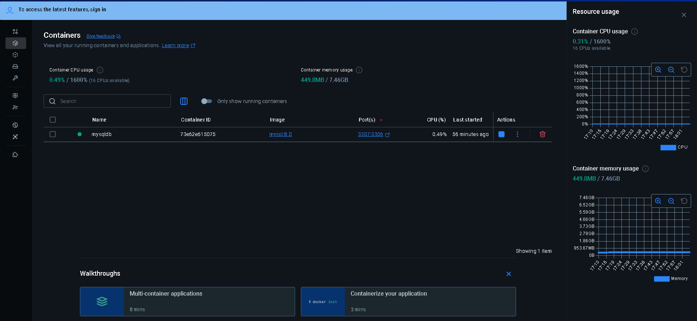
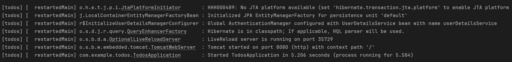
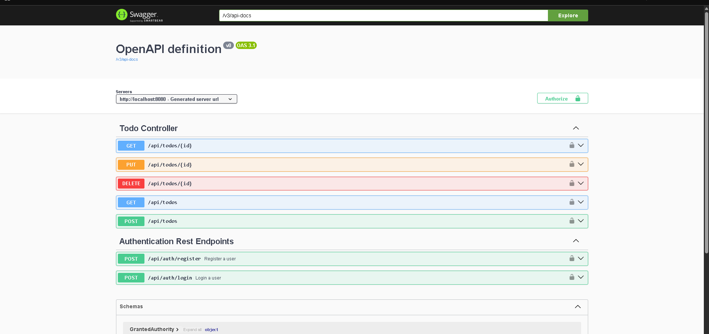
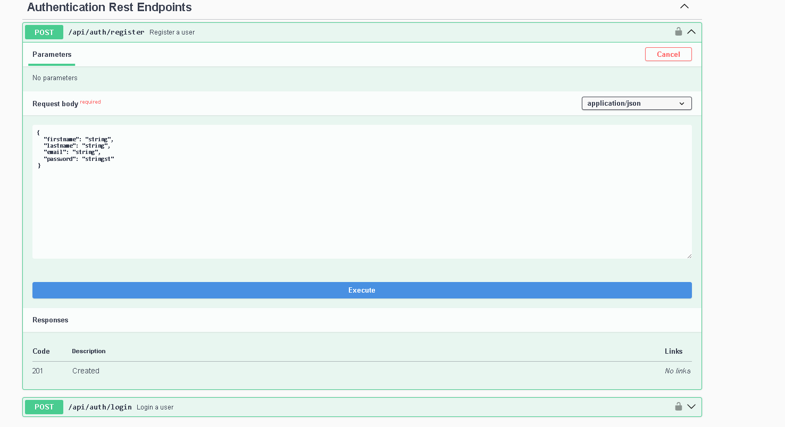
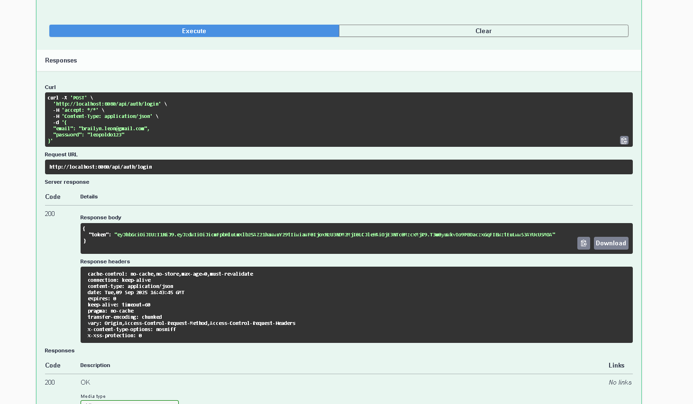

# Sistema de Gestión de Tareas (Todos).
# Autor: Brailyn León.

## Descripción General
Este proyecto es una aplicación backend robusta desarrollada en Spring Boot que proporciona un sistema completo de gestión de tareas con autenticación segura JWT y autorización basada en roles. La aplicación permite a los usuarios registrarse, autenticarse y gestionar sus tareas personales de manera segura.

## Características Principales

### Autenticación y Autorización
- Registro de usuarios con validación de email único
- Autenticación JWT con tokens de seguridad
- Autorización basada en roles (ROLE_EMPLOYEE y ROLE_ADMIN)
- El primer usuario registrado obtiene automáticamente privilegios de administrador

### Gestión de Tareas
- Creación, lectura, actualización y eliminación de tareas
- Acceso restringido: cada usuario solo puede acceder a sus propias tareas
- Validación de propiedad antes de cualquier operación

### Seguridad
- Contraseñas encriptadas con BCrypt
- Tokens JWT con expiración configurable
- Protección contra acceso no autorizado
- Configuración de seguridad robusta con Spring Security

## Tecnologías Utilizadas
- Java 17+ con Spring Boot 3.x
- Spring Security con JWT
- MySQL Database
- Spring Data JPA
- Swagger/OpenAPI para documentación
- Maven para gestión de dependencias

## Configuración del Entorno
### Requisitos Previos
- Java 17 o superior
- MySQL 5.7+ o 8.x
- Maven 3.6+

### Configuración de la Base de Datos
Crear una base de datos MySQL llamada `tododb`

Configurar las credenciales en `application.properties`:
```properties
spring.datasource.url=jdbc:mysql://localhost:3307/tododb
spring.datasource.username=root
spring.datasource.password=secret
```

### Variables de Configuración
- `spring.jwt.secret`: Clave secreta para firmar tokens JWT
- `spring.jwt.expiration`: Tiempo de expiración del token (900000ms = 15 minutos)
- `spring.jpa.hibernate.ddl-auto=update`: Actualización automática del esquema de BD

## Instalación y Ejecución
Clonar el proyecto:
```bash
git clone <repository-url>
cd todos
```

Compilar el proyecto:
```bash
mvn clean compile
```

Ejecutar la aplicación:
```bash
mvn spring-boot:run
```

Acceder a la documentación API:
- Swagger UI: [http://localhost:8080/docs](http://localhost:8080/docs)
- Endpoints API disponibles en: [http://localhost:8080/api/](http://localhost:8080/api/)

## Estructura del Proyecto
```
src/
├── main/
│   ├── java/
│   │   └── com/example/todos/
│   │       ├── config/          # Configuración de seguridad y beans
│   │       ├── controller/      # Controladores REST
│   │       ├── entity/          # Entidades de base de datos
│   │       ├── repository/      # Repositorios de datos
│   │       ├── service/         # Lógica de negocio
│   │       └── request/         # DTOs para requests
│   └── resources/
│       └── application.properties # Configuración de la aplicación
```

## API Endpoints
### Autenticación
- `POST /api/auth/register` - Registrar nuevo usuario
- `POST /api/auth/login` - Iniciar sesión y obtener token JWT

### Gestión de Tareas
- `GET /api/todos` - Obtener todas las tareas del usuario actual
- `POST /api/todos` - Crear nueva tarea
- `GET /api/todos/{id}` - Obtener tarea específica
- `PUT /api/todos/{id}` - Actualizar tarea existente
- `DELETE /api/todos/{id}` - Eliminar tarea

## Roles y Permisos
- `ROLE_EMPLOYEE`: Puede gestionar sus propias tareas
- `ROLE_ADMIN`: Privilegios adicionales (extensible para futuras funcionalidades)

## Consideraciones de Seguridad
- Validación de propiedad en todas las operaciones de tareas
- Tokens JWT firmados con clave secreta robusta
- Contraseñas encriptadas en la base de datos
- Headers de seguridad configurados apropiadamente
- Protección contra ataques CSRF deshabilitada para API REST

## Desarrollo Futuro
- Implementación de tests automatizados
- Funcionalidades de administración para usuarios con ROLE_ADMIN
- Integración con frontend React/Angular/Vue
- Sistema de recuperación de contraseñas
- Notificaciones por email
- API de reporting y analytics

**Nota:** Esta aplicación está diseñada para entornos de producción después de realizar las configuraciones de seguridad apropiadas y pruebas exhaustivas.

# Capturas de pantalla para guía visual.












